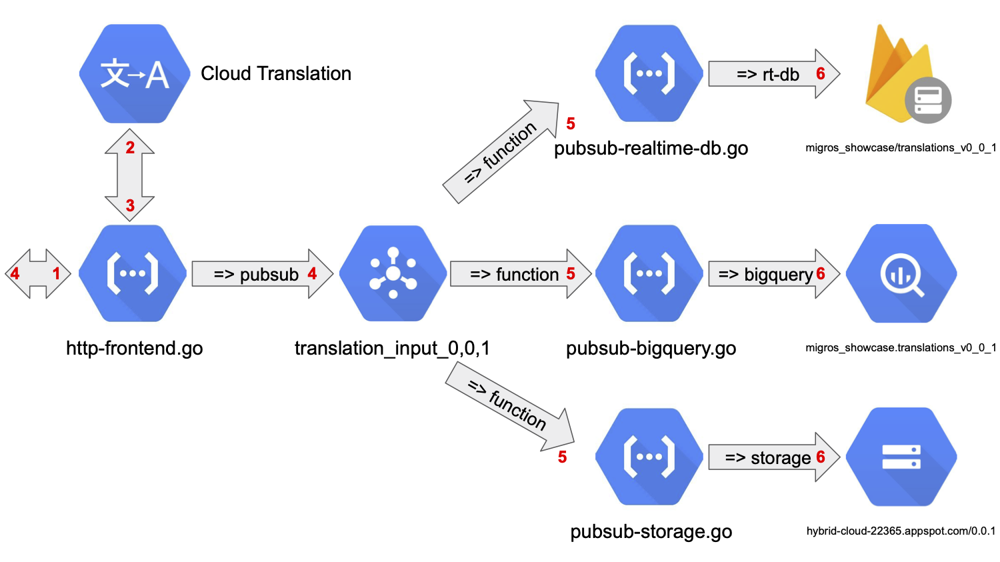

# Serverless backend showcase

The scenario provides an API to translate text in various languages and to store the created information in different 
services.

Using Cloud Functions in Go and Cloud Pub/Sub for fan-in/out of messages 
to connect the following services:

- Cloud Translation
- Firebase Realtime Database
- BigQuery
- Cloud Storage

This schema shows the structure of the backend.
     


#### Cloud Functions

[./functions](./functions)

We can trigger Cloud Functions by HTTP calls or as background functions by other event providers.

```bash
EVENT_PROVIDER                   EVENT_TYPE                                                RESOURCE_TYPE       
cloud.pubsub                     google.pubsub.topic.publish                               topic               
cloud.pubsub                     providers/cloud.pubsub/eventTypes/topic.publish           topic               
cloud.storage                    google.storage.object.archive                             bucket              
cloud.storage                    google.storage.object.delete                              bucket              
cloud.storage                    google.storage.object.finalize                            bucket              
cloud.storage                    google.storage.object.metadataUpdate                      bucket              
cloud.storage                    providers/cloud.storage/eventTypes/object.change          bucket              
google.firebase.analytics.event  providers/google.firebase.analytics/eventTypes/event.log  firebase analytics  
google.firebase.database.ref     providers/google.firebase.database/eventTypes/ref.create  firebase database   
google.firebase.database.ref     providers/google.firebase.database/eventTypes/ref.delete  firebase database   
google.firebase.database.ref     providers/google.firebase.database/eventTypes/ref.update  firebase database   
google.firebase.database.ref     providers/google.firebase.database/eventTypes/ref.write   firebase database   
google.firestore.document        providers/cloud.firestore/eventTypes/document.create      firestore document  
google.firestore.document        providers/cloud.firestore/eventTypes/document.delete      firestore document  
google.firestore.document        providers/cloud.firestore/eventTypes/document.update      firestore document  
google.firestore.document        providers/cloud.firestore/eventTypes/document.write       firestore document  
```

#### Cloud Pub/Sub

We can publish messages to Pub/Sub topics by Cloud Functions programmatically. Some services, like Cloud Logging and 
Dataflow, publish messages to Pub/Sub as a data sink.

We can create Cloud Functions as a subscriber to Pub/Sub topics to process received messages appropriately.

    
#### DevOps Pipelines 

[./pipeline](./pipeline)

Additionally, we provide DevOps pipelines to build, test, and deploy the Cloud functions using Cloud Build. Therefore, 
we connect our GitHub repository with a GCP Source Repository. We use standard cloud-builder images, and build our own 
if needed stored in our GCP Container Registry. The creation of these build trigger is half-automated by templates.

#### Wireformat

We send the messages in JSON format in between the services. 

```bash
{
  "clientVersion": "0.0.1",
  "clientId": "beab10c6-deee-4843-9757-719566214526",
  "taskId": "31427acf-42e6-4981-82d1-0abd2c5c2abe",
  "text": "Today is Wednesday",
  "sourceLanguage": "en",
  "targetLanguage": "fr",
  "translatedText": "Aujourd'hui nous sommes mercredi"
}
```

Frontend messages are in JSON format as well.

Request:

```bash
{
  "clientVersion": "0.0.1",
  "clientId": "beab10c6-deee-4843-9757-719566214526",
  "text": "Today is Wednesday",
  "sourceLanguage": "en",
  "targetLanguage": "fr"
}
```

Response:

```bash
{
 "taskId": "4d71c2a3-e6e1-4efd-bb1f-082227cfb0a5",
 "translatedText": "Aujourd'hui nous sommes mercredi",
 "loadCommands": [
  "firebase database:get --pretty --instance migros-showcase --project hybrid-cloud-22365 /translations_v0_0_1/beab10c6-deee-4843-9757-719566214526/4d71c2a3-e6e1-4efd-bb1f-082227cfb0a5",
  "bq query 'SELECT * FROM migros_showcase.translations_v0_0_1 WHERE taskId = \"4d71c2a3-e6e1-4efd-bb1f-082227cfb0a5\"'",
  "gsutil cat gs://hybrid-cloud-22365.appspot.com/0.0.1/beab10c6-deee-4843-9757-719566214526/4d71c2a3-e6e1-4efd-bb1f-082227cfb0a5 | jq",
  "gcloud logging read 'resource.type=cloud_function resource.labels.region=europe-west1 textPayload=4d71c2a3-e6e1-4efd-bb1f-082227cfb0a5'"
 ]
}
```

The response contains a list of commands to access services via CLI.


#### Versioning and A/B Testing

We use versioning for our microservices included in the messages to deploy different scenarios within the backend, not 
disturbing others, and useful for A/B testing, etc.

#### Security

We follow the principle of least privilege, providing roles to the service account 
for each active Cloud Function.

#### ToDos
Regarding performance, JSON should be replaced by ProtocolBuffers with gRPC. We should replace the Firebase Realtime 
Database by Firestore, and introduce Dataflow as serverless and unified stream and batch data processing. 

#### "Chain of Translation" - Mobile-first clients developed in Flutter

To create a mobile-first client we tried out Flutter and developed an app running on iOS and Android devices, plus 
as desktop and web application. The result was developed quick and dirty without any knowledge of idiomaticity or 
best practices.


